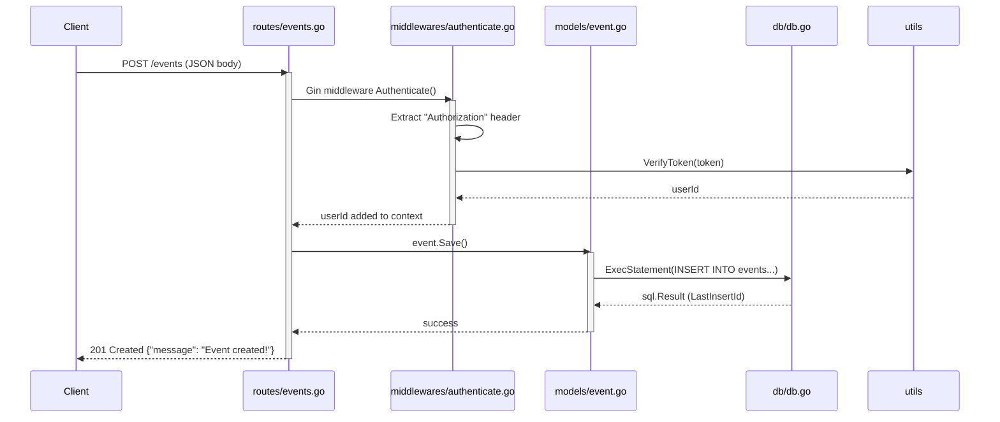

# GoRest

## Overview

A simple yet structured Go REST API built using Gin and SQLite, supporting:

- User signup and authentication (JWT)
- Event creation, update, deletion
- Event registration and cancellation

## 📁 Project Structure

```go
GoRest/
├── main.go
├── api-tests/
├── db/
│   └── db.go
├── models/
│   ├── user.go
│   └── event.go
├── routes/
│   ├── events.go
│   ├── register.go
│   ├── routes.go
│   └── users.go
├── middlewares/
│   └── auth.go
├── utils/
│   ├── hash.go
│   ├── jwt.go
│   └── parse.go
└── constants/
    └── context_keys.go
```

## ⚙️ How It Works

1. <b>Users can:</b>

- Sign up (POST /signup)
- Log in (POST /login) → receive a JWT token

2. <b>Authenticated users</b> (via Authorization header):

- Create events
- Update and delete their own events
- Register or cancel registration for any event

3. <b>Public routes:</b>

- View all events (GET /events)
- View a single event (GET /events/:id)

## 🧠 Core Components

🔸 <b>Database </b>(db/db.go)

- Uses modernc.org/sqlite (pure Go SQLite driver)
- Initializes database and tables on startup
- Provides a helper ExecStatement() for executing SQL safely

🔸 <b>Models</b> (models/)

- User model: handles signup and credential validation
- Event model: CRUD operations and registration management
- Uses prepared statements via db.ExecStatement

🔸 <b>Middleware </b>(middlewares/authenticate.go)

- Verifies the Authorization token header
- Extracts and validates JWT
- Injects userId into Gin context for authenticated routes

🔸 <b>Routes </b>(routes/)

- Organized by domain:
  - auth.go: login and signup
  - events.go: CRUD for events
  - registrations.go: event registration and cancellation
- Routes registered in routes/router.go
- Protected endpoints require authentication middleware

🔸 <b>Utilities </b>(utils/)

- HashPassword, CheckPasswordHash: for password management
- GenerateToken, VerifyToken: for JWT authentication
- ParseInt64: safely parses URL parameters

## 🚀 Running the API

### Prerequisites

- Go 1.25.0+
- No external DB required (SQLite embedded)

### Run

```bash
go mod tidy
go run main.go
```

Server runs by default on http://localhost:8080

## 📡 Example Requests

### Sign Up

```bash
curl -X POST http://localhost:8080/signup \
  -H "Content-Type: application/json" \
  -d '{"email":"user@example.com","password":"1234"}'
```

### Login

```bash
curl -X POST http://localhost:8080/login \
  -H "Content-Type: application/json" \
  -d '{"email":"user@example.com","password":"1234"}'
```

### Create Event (requires token)

```bash
curl -X POST http://localhost:8080/events \
  -H "Content-Type: application/json" \
  -H "Authorization: <JWT_TOKEN>" \
  -d '{"name":"Conference","description":"Tech meetup","location":"Berlin","dateTime":"2025-10-10T15:00:00Z"}'
```

## 🧩 Example Database Schema

| Table             | Columns                                                      |
| ----------------- | ------------------------------------------------------------ |
| **users**         | id (PK), email, password                                     |
| **events**        | id (PK), name, description, location, dateTime, user_id (FK) |
| **registrations** | id (PK), event_id (FK), user_id (FK)                         |

## 🎬 Sequence Diagram


